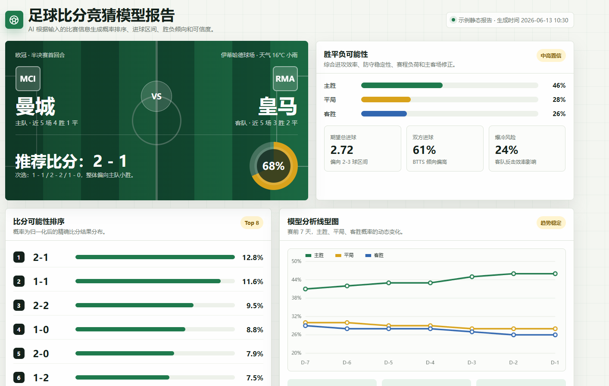

# Football Score Predictor Skill

一个用于足球比分竞猜与赛前分析的 Codex Skill。用户提供比赛信息后，智能体会联网检索伤停、阵容、赔率、盘口变化、赛程、天气、裁判、新闻等必要信息，再基于内置模型框架生成静态 HTML 预测报告。
关键词：足球比赛比分预测，足球预测，足球竞猜，比分竞猜，胜平负。

报告重点输出：

- 精确比分概率排序
- 可能进球数分布
- 胜平负概率
- 推荐比分与备选比分
- 预测可信度
- 比赛信息与关键证据
- 模型分析线型图
- 风险、不确定性与信息来源



## Skill 位置

```text
football-score-predictor/
```

主要文件：

```text
football-score-predictor/
  SKILL.md
  agents/openai.yaml
  assets/report-template.html
  references/model-stack.md
  references/report-schema.md
  scripts/generate_report.py
```

## 使用方式

把 `football-score-predictor` 文件夹安装到 Codex skills 目录后，可以用类似提示触发：

```text
Use $football-score-predictor 分析 曼城 vs 皇马，生成 HTML 比分预测报告
```
或者直接发给智能体
```text
帮我安装这个skill：https://github.com/beluug/football-score-predictor
```

真实预测时，Skill 要求智能体必须联网搜索和交叉验证当前信息，不能只凭记忆或历史印象直接给结论。

## 内置模型框架

该 Skill 使用一套可解释的集成预测框架：

- Elo 动态实力评分
- xG / xGA 预期进球模型
- 时间衰减加权
- 阵容强度模型
- Dixon-Coles 模型
- Poisson 进球模型
- Bivariate Poisson 双变量泊松
- 负二项分布模型
- Skellam 净胜球模型
- 赔率去水模型
- 赔率变动 / 盘口变化模型
- 凯利指数 / 市场偏差分析
- LightGBM / XGBoost 集成校准模型
- 逻辑回归校准层
- 概率校准模型
- Monte Carlo 模拟
- 贝叶斯不确定性估计
- 情境修正模型
- 冷门风险模型
- 可信度评分模型

整体流程：

```text
比赛信息输入
  -> Elo + xG + 时间衰减 + 阵容强度
  -> Poisson / Dixon-Coles / Bivariate Poisson / 负二项生成比分矩阵
  -> Skellam 生成净胜球和让球倾向
  -> 赔率去水 + 盘口变化 + 凯利指数做市场校准
  -> LightGBM/XGBoost + 逻辑回归做最终概率融合
  -> Monte Carlo + 贝叶斯不确定性估计
  -> 输出 HTML 报告
```

## HTML 报告生成

Skill 内置了静态 HTML 模板和生成脚本。

使用方式：

```bash
python football-score-predictor/scripts/generate_report.py --input report.json --output report.html
```

`report.json` 需要符合：

```text
football-score-predictor/references/report-schema.md
```

生成的 HTML 是自包含文件，可以直接用浏览器打开。

## 信息质量要求

真实比赛预测必须尽量检索：

- 官方伤停、停赛、阵容消息
- 预计首发和临场轮换风险
- 赔率、盘口、初盘与即时盘变化
- 最近战绩、xG、进攻和防守状态
- 赛程密度、旅行距离、战意和杯赛规则
- 天气、场地、裁判风格
- 可靠新闻源和数据源

如果关键数据缺失，报告必须降低可信度，并在风险说明中明确标注。

## License

MIT License. See [LICENSE](LICENSE).

## 免责声明

本项目生成的足球比赛预测、比分概率、胜平负概率、进球数分布和相关分析，仅用于信息参考、模型研究和娱乐讨论，不构成任何形式的投注建议、投资建议、财务建议或保证性结论。足球比赛结果受临场阵容、伤病、天气、裁判判罚、红牌、战术变化、偶然事件等多种不可控因素影响，任何模型都无法保证预测准确。

使用者应自行判断相关信息的可靠性，并自行承担基于本项目输出所做任何决策的全部风险。项目作者和贡献者不对因使用、引用或依赖本项目内容而产生的任何直接或间接损失负责。
